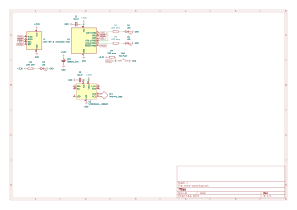
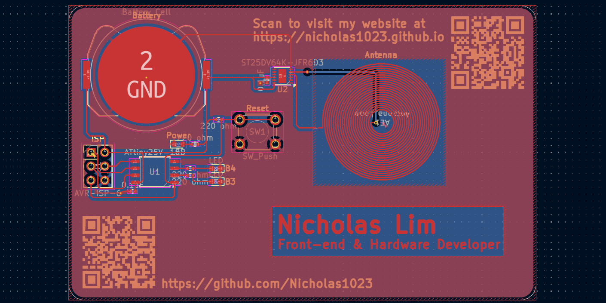
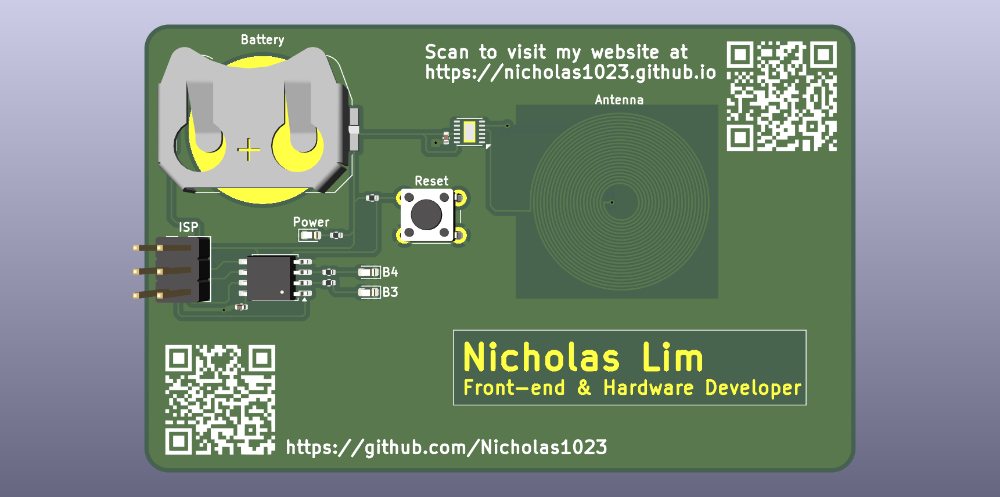

# My PCB Name Card
My PCB name card has a microcontroller that lights 2 LEDs as it's output. It also has wireless capabilities on it. The card uses a 3V CR2032 battery to power it.

## Schematic

## PCB

